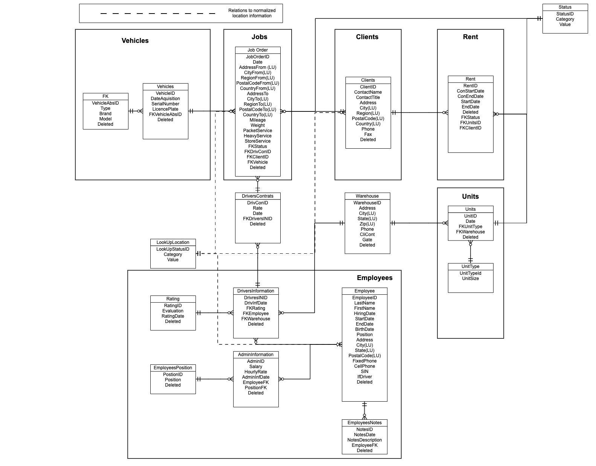

# In-class Activity: Office Machine

Professor: Khattar Daou
Student: Lucas Napoli / Phillip Spencer-Boucher
Development: MovinOn

# Purpose of the database
## Tracking the operations of MovinOn. Mainly logistic and rental operations. 

Database should be designed thinking in the data flow process taking in to consideration the main data entries processes: **Job Management**,**Rental Control**, **Clients**, **Employees**, **Drivers**  and **Warehouse**. For that reason, some work flows has been taking into consideration:
1. Employees
2. Clients 
3. Vehicles 
4. Jobs
5. Rentals
6. Warehouse
7. Units

# Assumptions: Users Stories 

Some assumptions are important to design the database:
1. Credentials management tables are not required
2. Logical deletion will be implemented to avoid delete records
3. Control fields are not required
4. Business rules will be implemented in other layer
5. We are going to work with states (in-progress, completed, etc) in the cases of jobs and Rent

# PickLists

1. No lookup table will be implemented

# Other considerations
1. Record managed by date to keep the track of the changes
2. Logic deletion is implemented with a boolean datatype

# ER Diagram

# License
----

MIT
**Free Software**
